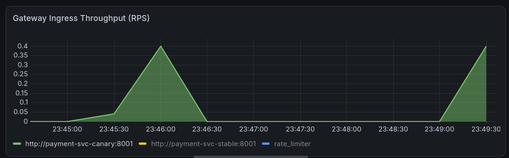
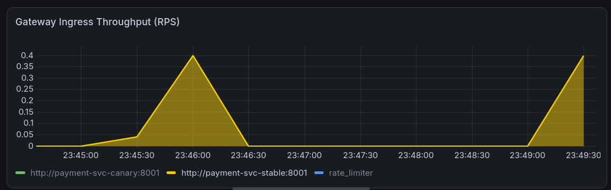
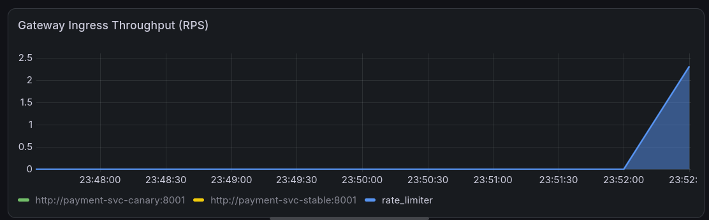
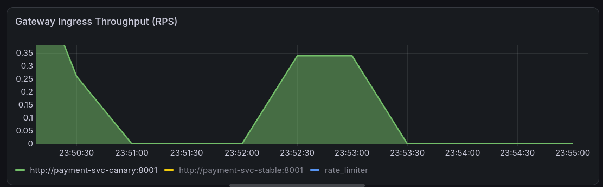
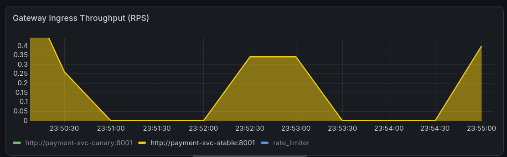

# go-reverse-proxy


A Layer-7 reverse proxy and API gateway written in Go. Routes traffic across multiple upstreams with round-robin load balancing, active health checks, a per-upstream circuit breaker, per-IP token-bucket rate limiting, and asynchronous metrics (Prometheus pull + AWS CloudWatch push). Ships as a multi-stage distroless container, deployed on a **Cilium/eBPF** kind cluster (kube-proxy fully disabled) and managed by the companion [go-proxy-operator](https://github.com/krishjj8/go-proxy-operator).

---

## Quick start

### Run locally (no container)

```bash
git clone https://github.com/krishjj8/go-reverse-proxy
cd go-reverse-proxy
go mod download
go build -o proxy ./cmd/proxy/...

# Two test upstreams in separate terminals
python3 -m http.server 8001
python3 -m http.server 8002

./proxy --config config.yaml
curl -H "Host: api.proxy" http://localhost:8080/
```

### Run on a kind + Cilium cluster

> **Note:** The steps below apply manifests from `k8s/` directly and are intended for isolated debugging only. For standard deployment, use the [go-proxy-operator](https://github.com/krishjj8/go-proxy-operator) to provision and manage all Kubernetes resources via a `ProxyService` CR.

```bash
# 1. Create the cluster with default CNI and kube-proxy disabled
kind create cluster --config kind-config.yaml

# 2. Install Cilium as the sole CNI and kube-proxy replacement
cilium install \
  --set kubeProxyReplacement=true \
  --set k8sServiceHost=kind-control-plane \
  --set k8sServicePort=6443

cilium status --wait

# 3. Build and side-load the image
docker build -t go-reverse-proxy:latest .
kind load docker-image go-reverse-proxy:latest

# 4. Apply manifests directly (debug path — operator handles this in production)
kubectl apply -f k8s/configmap.yaml
kubectl apply -f k8s/deployment.yaml
kubectl apply -f k8s/backend-security-policy.yaml

# 5. Open the tunnel
kubectl port-forward svc/go-reverse-proxy-service 8080:8080 9090:9090
```

---

## Architecture

```
                        ┌──────────────────────────────────────┐
                        │  Cilium eBPF data plane              │
                        │  (kube-proxy disabled)               │
                        └──────────────┬───────────────────────┘
                                       │
                              Client request
                                       │
                      ┌────────────────▼────────────────┐
                      │   Rate limiter  :8080            │
                      │   token bucket / per source IP   │
                      └────────────────┬────────────────┘
                                       │
                      ┌────────────────▼────────────────┐
                      │   Engine.ServeHTTP               │
                      │   Host-header routing table      │
                      └────────────────┬────────────────┘
                                       │
                      ┌────────────────▼────────────────┐
                      │   UpstreamPool.Next()            │
                      │   round-robin + breaker check    │
                      └─────────┬──────────┬────────────┘
                                │          │
                    ┌───────────▼──┐  ┌────▼──────────┐
                    │  Upstream A  │  │  Upstream B   │
                    │  (stable)    │  │  (canary)     │
                    └───────────┬──┘  └────┬──────────┘
                                └─────┬────┘
                                      │  LogEntry → buffered channel
                      ┌───────────────▼──────────────────┐
                      │   Telemetry worker (goroutine)    │
                      └──────────┬──────────┬────────────┘
                                 │          │
                   Admin :9090/metrics   CloudWatch PutMetricData
                   /healthz  /debug/pprof
```

---

## Features

### Round-robin load balancing
Each upstream pool is guarded by a `sync.RWMutex`. Concurrent requests read the healthy-upstream slice without blocking each other; the background health checker holds an exclusive write lock only when it updates the slice.

### Circuit breaker (3-state FSM)
One breaker per upstream:

| State | Behaviour |
|---|---|
| **Closed** | Normal forwarding. |
| **Open** | After 3 consecutive failures, requests to that upstream return immediately without touching the network. |
| **Half-open** | After a 10 s cooldown one canary request is let through. Success resets to Closed; failure restarts the cooldown in Open. |

### Per-IP rate limiting
Token bucket via `golang.org/x/time/rate` — 10 req/s refill, burst 20. Excess requests return `429 Too Many Requests`. Each source IP gets its own limiter, initialised on first contact.

### Asynchronous telemetry
The request path only sends a small `LogEntry` struct onto a buffered channel (capacity 10 000). A background worker drains it and updates two sinks:
- **Prometheus** — counters and histograms, scraped from `:9090/metrics`.
- **AWS CloudWatch** — `PutMetricData` with no credentials in source (IAM instance profile).

### CiliumNetworkPolicy enforcement
`k8s/backend-security-policy.yaml` applies a whitelist at the eBPF layer: only pods labelled `app: go-reverse-proxy` may reach the payment backend on port `8001`. Everything else is dropped in-kernel before it reaches the container.

---

## Observability

Two ports are exposed — the data plane (`:8080`) carries traffic; the admin plane (`:9090`) carries everything else.

| Metric | Type | Labels | What it tells you |
|---|---|---|---|
| `proxy_requests_total` | Counter | `upstream`, `status_code` | Request volume, error rates |
| `proxy_request_duration_ms` | Histogram | `upstream` | Latency distribution (p50 / p95 / p99) |

```bash
# Live Prometheus scrape
curl http://localhost:9090/metrics | grep proxy_

# CPU profile (30 s)
go tool pprof http://localhost:9090/debug/pprof/profile

# Heap snapshot
go tool pprof http://localhost:9090/debug/pprof/heap
```

Hubble (Cilium's flow visibility layer) gives you kernel-level flow logs without touching application code:

```bash
cilium hubble port-forward &
hubble observe --follow                        # all flows
hubble observe --verdict DROPPED --follow      # policy violations only
```

---

## Validate the full system

```bash
# Health
curl -i http://localhost:9090/healthz

# Basic routing
curl -H "Host: api.proxy" http://localhost:8080/

# Rate limiter — expect ~20 OK then 429s
hey -n 50 -c 5 -H "Host: api.proxy" http://localhost:8080/

# Circuit breaker — kill one upstream, watch the breaker trip
kubectl scale deployment payment-canary-deployment --replicas=0
curl -H "Host: api.proxy" http://localhost:8080/
```

---

## Experiments

### Experiment 2 — Layer 7 round-robin load balancing

**What it tests:** Concurrency-safe routing distribution across the upstream pool.

Dispatched 40 requests against `:8080`. The `UpstreamPool.Next()` method increments a counter under `sync.Mutex` and selects `healthy[counter % len(healthy)]`, producing exact 50/50 split across stable and canary.

```bash
for i in $(seq 1 40); do
  curl -s -o /dev/null -H "Host: api.proxy" http://localhost:8080/
done
```

**PromQL:** `sum(rate(proxy_requests_total[1m])) by (upstream)`

Both upstream series climb in parallel at `0.4 RPS` each — identical curves, no drift.




---

### Experiment 3 — Token-bucket rate limiter

**What it tests:** Edge self-defense under aggressive burst traffic.

Flooded the gateway with 150 zero-delay requests. The `RateLimiter` middleware runs before `Engine.ServeHTTP` — each IP gets its own `rate.Limiter` (10 req/s refill, burst 20). Once the bucket empties, the middleware returns `429` immediately without touching the upstream pool.

```bash
hey -n 150 -c 10 -H "Host: api.proxy" http://localhost:8080/
```

**PromQL:** `sum(rate(proxy_requests_total[1m])) by (status_code)`

Downstream targets stay flat at zero. The `429` series climbs vertically, peaking above `2.0 RPS`.



---

### Experiment 4 — Active health probing and zero-downtime failover

**What it tests:** Background health-check goroutine, upstream eviction, and async telemetry non-blocking guarantee.

Scaled the canary deployment to zero while a continuous traffic loop was running:

```bash
kubectl scale deployment payment-canary-deployment --replicas=0
```

The `startHealthCheckLoop()` goroutine polls each upstream every 5 seconds. When the canary stops responding, it is removed from the `healthy` slice. All subsequent `UpstreamPool.Next()` calls skip it — user-facing requests continue returning `200 OK` with `0 ms` added latency.

**Key log line:**
```
level=INFO msg="Upstream detected as UNHEALTHY" upstream="http://payment-svc-canary:8001"
```

CloudWatch `PutMetricData` network timeouts appear in the background worker log — proving the telemetry goroutine blocks independently and never stalls the request path.

**PromQL:** `sum(rate(proxy_requests_total[1m])) by (upstream)`

The canary series drops to zero. The stable series immediately doubles to absorb the full load.




---

## Configuration

`config.yaml` (or the `proxy-config` ConfigMap under Kubernetes):

```yaml
server:
  listen_address: ":8080"

routes:
  api.proxy:                          # matched against the Host header
    upstreams:
      - "http://payment-svc-stable:8001"
      - "http://payment-svc-canary:8001"
```

The ConfigMap is mounted as a volume at runtime — config changes don't require a container rebuild.

---

## Deployment

### Kubernetes (kind + Cilium)
Config lives in a `ConfigMap`, mounted into the pod. Two replicas run behind a `ClusterIP` Service, reached externally via an Ingress rule for `api.proxy`.

### AWS (EC2)
`t2.micro`, Ubuntu 24.04. The proxy runs as a `systemd` unit (`go-proxy.service`). Infra is provisioned with Terraform: custom VPC, public subnet, internet gateway, security group (ports 22 and 8080). CloudWatch credentials come from an IAM instance profile — no keys in source.

```bash
cd infra
terraform init && terraform apply
```

---

## CI

GitHub Actions on every push to `main`:

| Stage | Command |
|---|---|
| Dependencies | `go mod verify` |
| Format | `gofmt -l .` |
| Build | `go build ./cmd/proxy/...` |
| Deploy | disabled by default (`if: false`) |

---

## Known limitations

| Area | Issue | Planned fix |
|---|---|---|
| Telemetry backpressure | Channel send blocks when the worker falls behind CloudWatch | Non-blocking send with a drop counter |
| Rate-limiter memory | IP map grows unbounded, never evicted | LRU eviction or TTL sweep |
| Client IP behind LB | `RemoteAddr` returns the LB address, not the real client | Read `X-Forwarded-For` from trusted proxies only |
| Health check | Plain `GET /`, no dedicated path, body not always closed on non-200 | Configurable health path, always close body |
| Thresholds hardcoded | Rate limit and breaker config live in code | Move to `config.yaml` |
| Retry logic incomplete | `RetryTransport` attempts up to 3 times for `GET`/`HEAD` with 50 ms linear backoff, but retry count and backoff are hardcoded and not surfaced in config | Configurable retry policy; expose `POST`/`PUT` retry opt-in |
| No tests | Circuit breaker and rate limiter are pure logic | Unit tests + `go vet` + `go test ./...` in CI |

---

## Project layout

```
go-reverse-proxy/
├── cmd/proxy/          # main: startup wiring, signal handling, graceful shutdown
├── internal/
│   ├── proxy/          # engine, circuit breaker, rate limiter, admin server, telemetry
│   ├── config/         # YAML config loader
│   └── logger/         # structured JSON logging (slog)
├── k8s/
│   ├── configmap.yaml
│   ├── deployment.yaml
│   └── backend-security-policy.yaml
├── infra/              # Terraform: VPC, EC2, IAM, CloudWatch
├── Dockerfile          # multi-stage distroless build (golang:1.26-alpine → distroless/static)
├── kind-config.yaml    # disables default CNI and kube-proxy for Cilium
└── config.yaml
```

---

## Debugging log

Real issues from development, kept for reference.

**SSH key permissions**
```bash
chmod 400 ~/.ssh/demo.pem
ssh -i ~/.ssh/demo.pem ubuntu@<ec2-public-ip>
```

**Removing Terraform binaries from Git history**
```bash
git filter-branch --force --index-filter \
  "git rm -rf --cached --ignore-unmatch infra/.terraform/" \
  --prune-empty --tag-name-filter cat -- --all
git push origin main --force
```

**SCP deploy permissions (GitHub Actions)**
```bash
# Upload to home dir first, then sudo-move on the instance
scp -i key proxy ubuntu@<host>:~/proxy
sudo mv ~/proxy /opt/proxy/proxy && sudo chmod +x /opt/proxy/proxy
```

**Go version mismatch**
Local builds used Go 1.26; Docker builder defaulted to 1.24, breaking `go mod download`. Fixed by pinning the builder stage to `golang:1.26-alpine`.

---

## License

MIT
